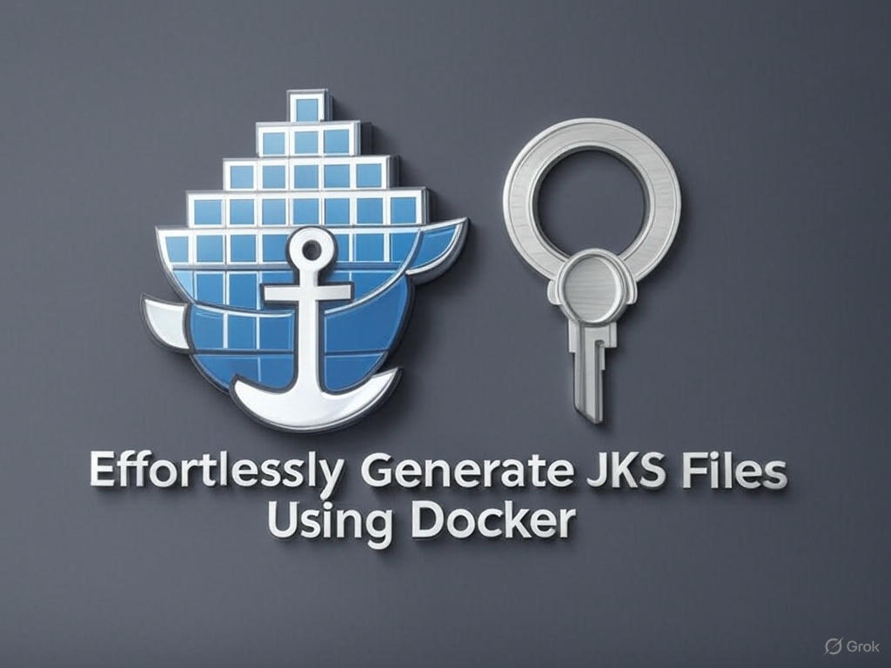

# Effortlessly Generate JKS Files Using Docker



## Overview
This repository provides a streamlined way to generate **Java KeyStore (JKS)** files for securing **Java applications** using **Docker**, as detailed in the [4-Minute Guide](https://medium.com/@yourusername/effortlessly-generate-jks-files-using-docker-a-4-minute-guide) (replace with your published URL). The logo, set against a gritty post-apocalyptic wasteland, symbolizes the resilience of automated security solutions with Docker (anchor) and JKS keys. Ideal for learning **SSL** and **Java security**, this setup is perfect for APIs, microservices, or local development.

## Features
- Automates JKS file generation with a `cert-gen` Docker container.
- Uses Docker Compose to orchestrate the process.
- Stores JKS files in `<YOUR_PROJECT_DIR>/certs/output` for easy access.
- Validates generated files for correctness.

## Getting Started

### Prerequisites
- **Docker Desktop** and **Docker Compose** installed.
- A directory (e.g., `<YOUR_PROJECT_DIR>`) shared in Docker Desktop (Settings > Resources > File Sharing).

### Setup
1. **Clone the Repository**
   ```bash
   git clone https://github.com/amarsamanttech/create_jks_using_docker.git
   cd your-repo